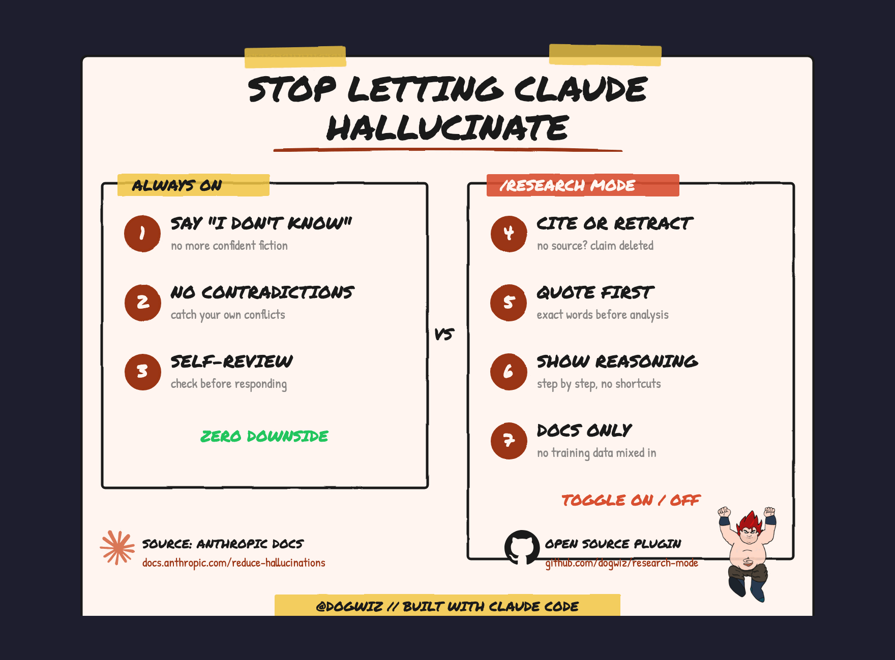

<p align="center">
  
</p>

<h1 align="center">research-mode</h1>

<p align="center">
  Anti-hallucination plugin for Claude Code.<br>
  One command. Four constraints. Zero hallucinated "facts" in your research.
</p>

<p align="center">
  <a href="LICENSE"></a>
  <a href="https://docs.anthropic.com/en/docs/test-and-evaluate/strengthen-guardrails/reduce-hallucinations"></a>
  
  
</p>

---

## What it does

Type `/research` and Claude stops guessing.

| Constraint | What happens | Why it matters |
|-----------|-------------|----------------|
| **Verify with citations** | Every claim needs a source. No source = `[retracted]` | Removes confident-sounding fiction |
| **Direct quotes for factual grounding** | Extracts exact quotes before analyzing | Kills paraphrase-drift |
| **Chain-of-thought verification** | Step-by-step logic before conclusions | Surfaces bad assumptions |
| **External knowledge restriction** | Only uses info from provided documents | `--docs` flag only |

Type `exit research mode` to go back to normal.

## Install

**Plugin (recommended):**

```
claude plugin add ibliminse/research-mode
```

**Manual:**

```bash
git clone https://github.com/ibliminse/research-mode.git ~/.claude/skills/research-mode
```

## Usage

```
/research
```

This activates 3 constraints: citations, direct quotes, and chain-of-thought. Claude can still use its general knowledge — it just has to be rigorous about it.

With a topic:

```
/research what caused the Change Healthcare breach
```

### `--docs` flag

When you're analyzing specific documents and need to know exactly what came from your source vs. Claude's training data:

```
/research --docs
```

This adds a 4th constraint: **external knowledge restriction**. Claude will ONLY use information from documents you provide. No general knowledge mixed in.

```
/research --docs review this contract for liability issues
```

**When to use `--docs`:** Legal review, financial analysis, compliance audits — any time you need to trust that every insight came from YOUR documents, not Claude's training data.

**When to skip `--docs`:** General research, fact-checking, exploration — you want Claude's knowledge, just with citations and reasoning.

## Why not all 7 all the time?

Anthropic published [7 anti-hallucination techniques](https://docs.anthropic.com/en/docs/test-and-evaluate/strengthen-guardrails/reduce-hallucinations). I split them:

**3 should be always on** (no downside):

1. Say "I don't know" — never fill gaps with fiction
2. Don't contradict yourself — catch your own conflicts
3. Self-review before responding — one mental pass before answering

**4 are a toggle** (this plugin):

4-7 add rigor that's valuable for research but would slow down creative work. Citation requirements are overkill for "should I use flexbox or grid." Step-by-step reasoning is noise when you're brainstorming. Sometimes you *want* Claude to use general knowledge.

Research mode is a scalpel, not a lifestyle.

### Want the 3 always-on?

Add this to `~/.claude/rules/` or your `CLAUDE.md`:

```markdown
## Anti-Hallucination (Always On)

1. If you don't have a credible basis for a claim, say so.
   Never fill knowledge gaps with plausible fiction.
   "I don't have enough information" is always a valid answer.

2. When making multiple related claims, verify they're consistent.
   If you catch a contradiction, flag and resolve it before presenting.

3. For non-trivial responses, do one mental pass:
   "Can I actually back up each claim I'm about to make?"
   Cut anything you can't.
```

## How it works

This is a single markdown file (`commands/research.md`) that Claude reads and follows. No dependencies, no build step, no API calls, no external services.

When active, Claude structures output as:

```
Finding: [claim]
Source: [file path, URL, quote number, or named source]
Confidence: high / medium / low
```

Unsupported claims are retracted:

```
[retracted — no source found]
```

## Source

Based on Anthropic's official documentation:
[docs.anthropic.com/en/docs/test-and-evaluate/strengthen-guardrails/reduce-hallucinations](https://docs.anthropic.com/en/docs/test-and-evaluate/strengthen-guardrails/reduce-hallucinations)

## License

MIT -- do whatever you want with it.
